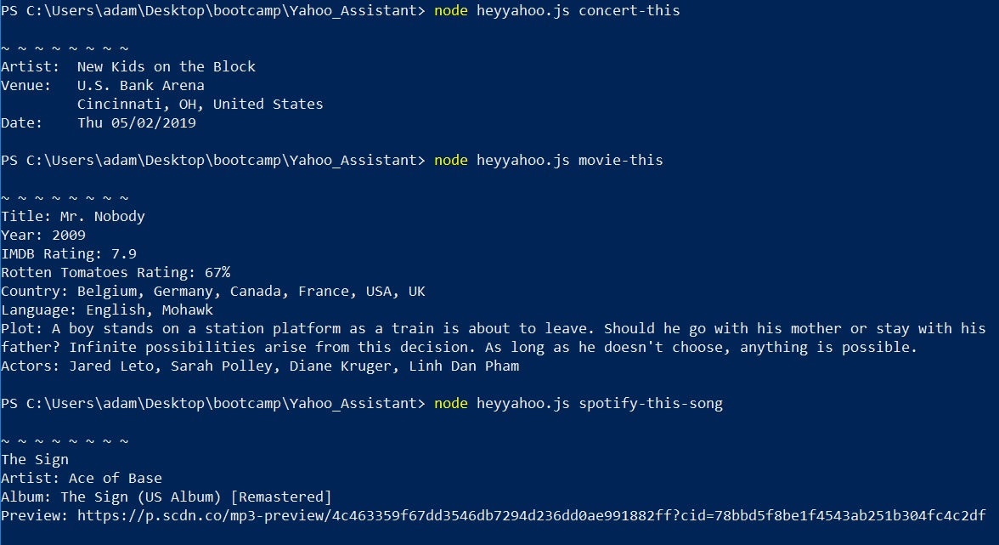

# Yahoo Assistant  

##### New aritificial intelligence engine created for Yahoo. Everything you need in a personal assistant as long as it's one of these 3 things:

- #### Song information 
  Get Artist, Album, and a link to listen to a preview on Spotify for a song entered.

- #### Concert information:
  Get venue, location, and date for a concert of the musician/band entered.

- #### Movie information
  Get release year, IMDB Rating, Rotten Tomatoes rating, country of production, language, plot, and actors of the movie entered.

----------

## Installation

If you haven't already, install [Node.js](https://nodejs.org/en/download/)

Clone the repository to your computer. At Command Line Interface, navigate to the project folder and run the following to install the node packages:

 `````````shell
 npm i
 `````````

#### API Keys

You will need to provide your own API keys. In the root of you project folder Create a `.env` file and add the following code, inserting your own API Keys. 

 `````````js
 # Spotify API keys
 SPOTIFY_ID=//your-spotify-id
 SPOTIFY_SECRET=//your-spotify-secret
 `````````

----------

## Workflow

#### Commands:
 - `concert-this` 
 - `spotify-this-song`
 - `movie-this`

Use the commands with node at the Command Line Interface

 ```shell
 node heyyahoo.js concert-this britney spears
 node heyyahoo.js spotify-this-song slave 4 u
 node heyyahoo.js movie-this crossroads
 ```




----------

## Project
A class assignment at UCI Coding Bootcamp focused on Node.js and Node Package Manager

#### Requirements:

##### Node Packages:
- [Request](https://www.npmjs.com/package/request)
- [DotEnv](https://www.npmjs.com/package/dotenv)
- [Moment](https://www.npmjs.com/package/moment)
- [Node-Spotify-API](https://www.npmjs.com/package/node-spotify-api) 

##### APIs:
- [Bands In Town API](http://www.artists.bandsintown.com/bandsintown-api)
- [OMDB API](http://www.omdbapi.com)
- [Spotify](https://developer.spotify.com/)
